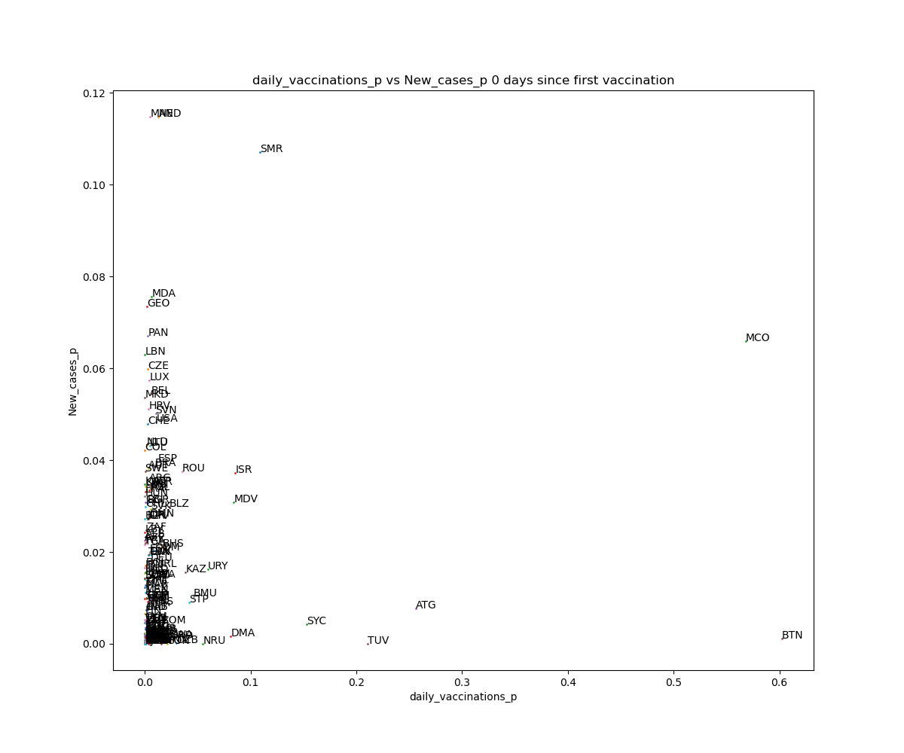
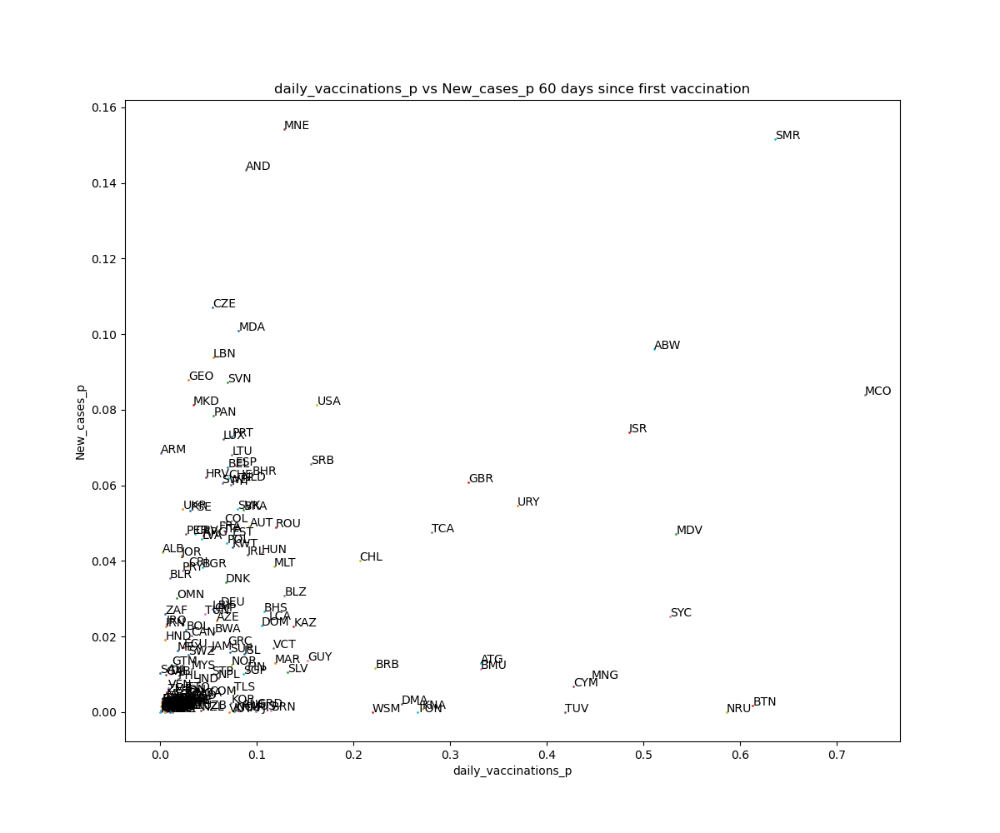
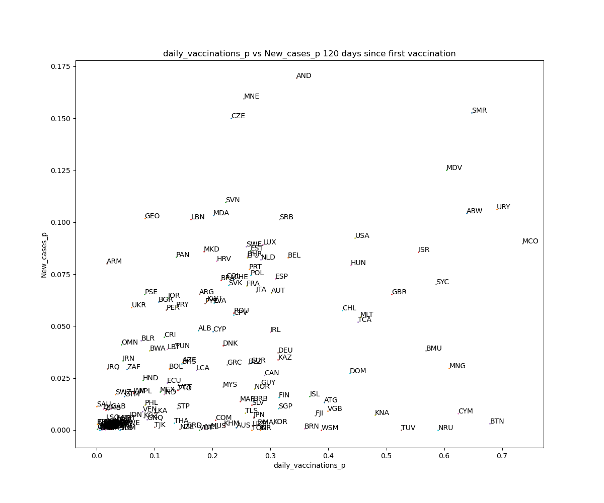

## CSCI 4502/5502: Data Mining Course Project

```
Group Members:

  Avery Lawson 
  Jay Bentley
  Michael Thomas
  Nick O'Connor
```

## Our Code:

The entirety of our project's code is within Jupyter Notebook files in the `./Python` directory. The important files for our project can be split into two parts. First half of our files are centered around cleaning and setting up our data while the second half is about working with the cleaned data:
```
Python/        
  cleaning.ipynb                    | 
  normalization.ipynb               |   Setting up data
  per capita.ipynb                  |


  ARIMA.ipynb                       |
  LSTM.ipynb                        | 
  clustering.ipynb                  | 
  correlation_visualization.ipynb   |   Working with cleaned data
  states.ipynb                      |
                                    |
Visualizations/                     |
  visualizations.ipynb              |
```

## Our Data:

We have 3 folders in the `./Data` directory, all for different stages of our datasets. The raw `.csv` files we downloaded are in the `./Data/Original-Data` directory, while everything we actually used for our code is in `./Data/Final_Datasets`. Within `Final_Datasets` we have multiple files that end in `_p` which signifies that the csv file has been adjusted to have per capita data instead of raw numbers.

## Visualizations

Many graphs were generated in the making of this project, and while most of the important ones were included in our report, there are more found in the `./Visualizations/images` directory. 

Some of these visualizations (and the paths on where to get to them) can be seen below:

`./Visualizations/images/Box Plot Daily Vaccinations Comparison.png`


`./Visualizations/images/scatter/scatter0.png`



`./Visualizations/images/scatter/scatter60.png`



`./Visualizations/images/scatter/scatter120.png`



`./Visualizations/images/Daily Vaccinations Over Time.png`

